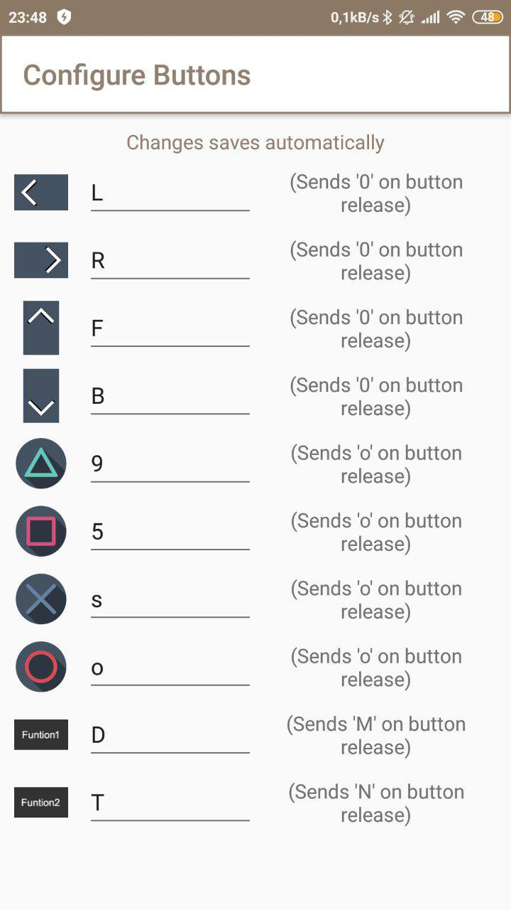

# Hexapodo Vorpal

Se trata de una simplificación del hexápodo vorpal para controlarlo via bluetooth desde una App en un teléfono Android

[Página del proyecto Vorpal](http://vorpalrobotics.com/wiki/index.php?title=Vorpal_The_Hexapod)

[Documentación del montaje](http://vorpalrobotics.com/wiki/index.php/Vorpal_The_Hexapod_Assembly_Instructions)

[Vídeo de montaje](https://www.youtube.com/watch?v=cf1dBCwsE0o)

## Conexión

Arduino Zum (para conseguir los 5V con suficiente potencia)
Bluetooth: Rx - 2 Tx - 3
Controlador de 16 servos de Adafruit: A4 - SDA A5 - SCL
2 baterías lipo 18650
12 servos 9g

[Conexiones eléctricas originales](http://vorpalrobotics.com/wiki/index.php/Vorpal_The_Hexapod_Prototype_Electrical_Connections)

## Programación

[Código original (para usar mando controlador)](https://github.com/vorpalrobotics/VorpalHexapod/blob/master/Vorpal-Hexapod-Robot/Vorpal-Hexapod-Robot.ino)

[Código adaptado para controlar con teléfono vía Bluetooth](./codigo/Vorpal-Hexapod-Robot-Bluetooth.ino)

## Aplicación de control

[Arduino Bluetooth Controler](https://play.google.com/store/apps/details?id=com.satech.arduinocontroller)

